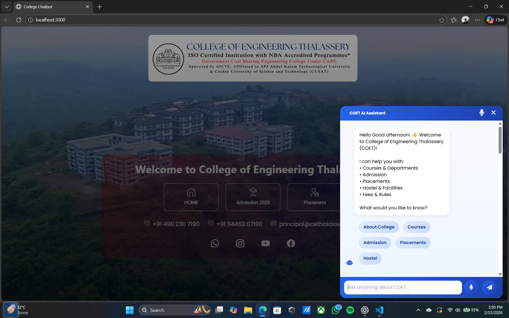
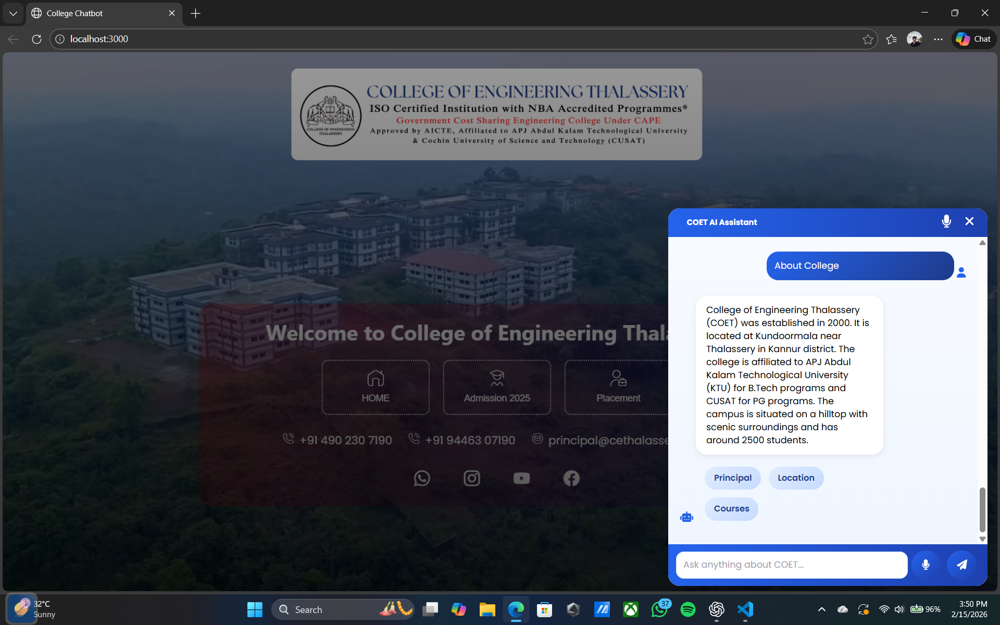
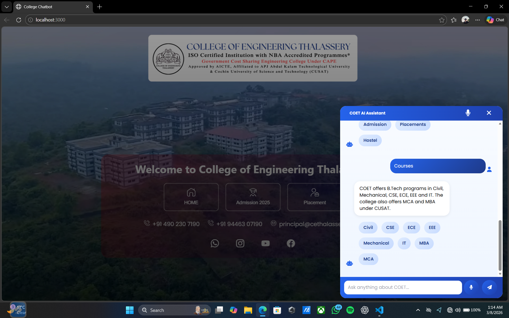
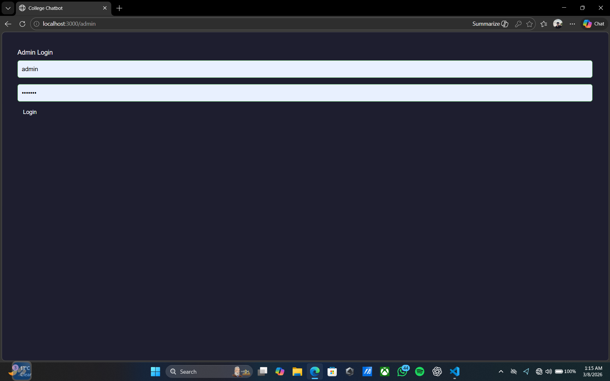
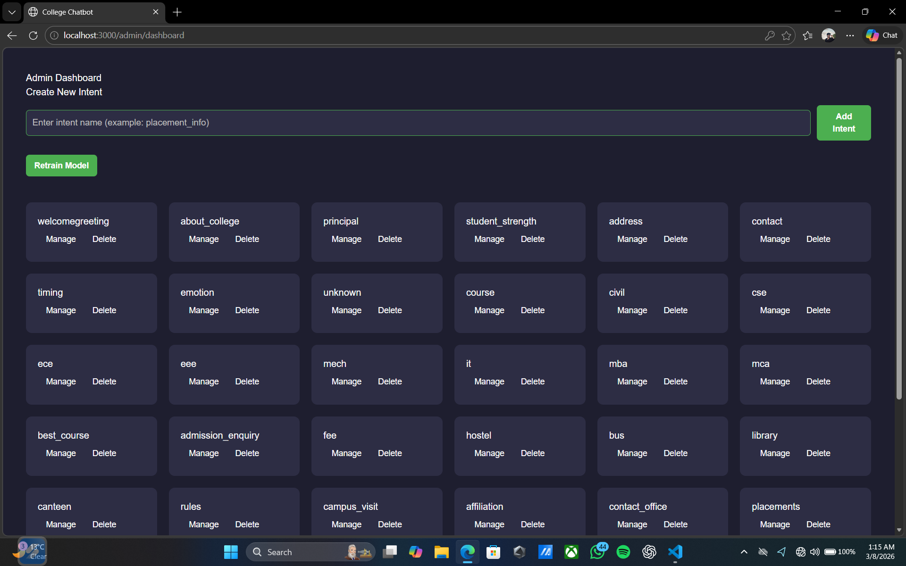

<div align="center">

# 🤖 AI College Enquiry Chatbot — COET

**An AI-powered virtual assistant for the College of Engineering Thalassery (COET)**, built with **React**, **FastAPI**, and a custom **NLP intent-classification engine** to answer student, parent, and visitor queries instantly.


[**Report Bug**](https://github.com/mridulpramod/AI-College-Enquiry-Chatbot/issues) · [**Request Feature**](https://github.com/mridulpramod/AI-College-Enquiry-Chatbot/issues)

</div>

---

## 📖 Overview

Most college websites bury admissions, fee, and placement info across a dozen static pages. This project replaces that with a conversational assistant that understands natural-language questions and responds instantly — trained on a custom intent-classification model rather than rigid if/else rules.

Built for **College of Engineering Thalassery (COET)**, it handles admissions, courses, fees, placements, hostel life, and transport queries through a chat widget embedded directly on the college site, backed by an admin panel for managing the knowledge base and retraining the model.

## 📸 Screenshots

<table>
<tr>
<td width="50%">

**Chat Widget — Landing**


</td>
<td width="50%">

**Contextual Q&A**


</td>
</tr>
<tr>
<td width="50%">

**Quick-Reply Navigation**


</td>
<td width="50%">

**Admin Login**


</td>
</tr>
<tr>
<td colspan="2">

**Admin Dashboard — Intent Management**


</td>
</tr>
</table>

## ✨ Features

| Category | Highlights |
|---|---|
| 🤖 **AI Chatbot** | Intent classification, NLP query understanding, spelling correction, dynamic responses |
| 🎓 **Student Assistance** | Admissions, courses & departments, fees, placements, hostel, transport, contacts |
| 📝 **Admission Enquiry Form** | Secure submission, stored leads, admin follow-up workflow |
| 📊 **Admin Panel** | View enquiries, manage intents, retrain the ML model, monitor training status |
| 🎤 **Smart Extras** | Speech-to-text input, text-to-speech output, quick-reply buttons, typing animation, clickable links |

## 🛠 Tech Stack

**Frontend** — React.js · Tailwind CSS · JavaScript (ES6) · Font Awesome
**Backend** — Python · FastAPI · Uvicorn · REST API · CORS Middleware
**Machine Learning** — TensorFlow · NumPy · NLTK · custom seq-to-vector / vector-to-class intent model
**Storage** — JSON knowledge base · trained model artifacts · config files

## 🏗 Architecture

```
User → React Frontend → FastAPI Backend → NLP Preprocessing
     → Intent Classification (TensorFlow) → Response Generation
     → JSON Knowledge Base → Response back to User
```

**ML pipeline:** Query → Text Cleaning → Spelling Correction → Tokenization → Embedding → Intent Classification → Response Retrieval → Chat Response

## 📂 Project Structure

```
AI-College-Enquiry-Chatbot/
├── backend/
│   ├── app/            # FastAPI application
│   ├── data/            # Knowledge base & training data
│   ├── models/          # Trained ML models
│   ├── tests/
│   ├── main.py
│   ├── config.py
│   └── requirements.txt
├── frontend/
│   ├── public/
│   ├── src/
│   └── package.json
└── README.md
```

## 🚀 Getting Started

### Prerequisites
Python 3.10+, Node.js 18+, npm

### 1. Clone & enter the repo
```bash
git clone https://github.com/mridulpramod/AI-College-Enquiry-Chatbot.git
cd AI-College-Enquiry-Chatbot
```

### 2. Backend setup
```bash
cd backend
python -m venv venv

# Activate
venv\Scripts\activate        # Windows
source venv/bin/activate     # Linux/macOS

pip install -r requirements.txt
uvicorn app.main:app --reload
```
Backend runs at `http://localhost:8000`

### 3. Frontend setup
```bash
cd frontend
npm install
npm start
```
Frontend runs at `http://localhost:3000`

## 📡 API Reference

| Method | Endpoint | Description |
|---|---|---|
| `GET` | `/query/{query}` | Send a natural-language question, get a chat response |
| `GET` | `/direct/{intent}` | Fetch a response for a known intent directly |
| `POST` | `/admin/save-admission` | Submit an admission enquiry |
| `GET` | `/admin/training-status` | Check current model training status |
| `POST` | `/admin/retrain` | Trigger model retraining |
| `GET` | `/admin/full-data` | Fetch full admin dashboard data |

## 🌐 Deployment (Free Tier)

| Layer | Recommended Host | Notes |
|---|---|---|
| Frontend (React) | [Vercel](https://vercel.com) or [Netlify](https://netlify.com) | Connect the GitHub repo for auto-deploy on push |
| Backend (FastAPI) | [Render](https://render.com) | Free web service; spins down after inactivity, wakes on request |
| Full-stack (alt.) | [Hugging Face Spaces](https://huggingface.co/spaces) | Good option if you want frontend + ML inference on one free host |

Not currently deployed — run locally using the steps above.

## 🔮 Roadmap

- [ ] Authentication & student login
- [ ] Persistent database (PostgreSQL/MongoDB) instead of JSON store
- [ ] Chat history & analytics dashboard
- [ ] WhatsApp integration
- [ ] Multi-language support
- [ ] RAG-based knowledge retrieval with LLM integration (OpenAI/Gemini)

## 👨‍💻 Developer

**Mridul Pramod**
B.Tech Computer Science Engineering — College of Engineering Thalassery (COET)
APJ Abdul Kalam Technological University (KTU)

[GitHub](https://github.com/mridulpramod) · [LinkedIn](https://www.linkedin.com/in/mridul-pramod-21729a372) · [Email](mailto:mridulpramod7994@gmail.com)

## 📄 License

Licensed under the [MIT License](LICENSE).

---

<div align="center">

⭐ **If this project helped you, consider starring the repo.**

</div>
